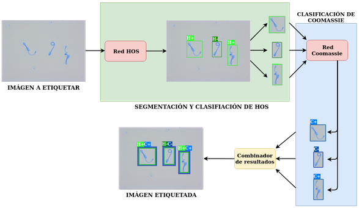

<head>

</a>

   
  
</head>
<body>

<h2>Proceso de segmentación, clasificación y obtención de etiquetas:</h2>

 Inicialmente se tiene una imagen de entrada que es analizada y procesada por la primera red, denominada red HOS. Esta realiza la segmentación de los espermatozoides junto con la clasificación de HOS, y brinda como salida una imagen etiquetada. A partir de esta, se recortan sub-imágenes con cada uno de los espermatozoides, como se aprecia en el recuadro verde. De estos recortes se descartan las que queden etiquetadas como NC, y las restantes son alimentadas a la segunda red, denominada red Coomassie, la cual clasifica cada espermatozoide como Coomassie positivo o negativo, centrando esta vez la atención en la coloración de la cabeza. Similar a la primera red, se tienen como salida las sub-imágenes clasificadas y etiquetadas, como se aprecia en el recuadro azul. Seguidamente, se toman las etiquetas generadas por ambas arquitecturas y se construye la etiqueta final que consta de los resultados de ambas clasificaciones, correspondientes a las etiquetas originales.

  

</a>

  

  
  

<h2>Instrucciones de uso:</h2>

 Ingresar al link de la aplicación, allí se le desplegará la interfaz mostrada en la imagen.

Una vez en ella dar clic en el botón para cargar imágenes, este le permite abrir el explorador de archivos de su dispositivo para cargar las imágenes que serán analizadas por el software.

Opcionalmente, en las Opciones de Configuración podrá modificar el umbral de confianza de la red. Para cambiar estos parámetros se debe desplazar los sliders correspondientes, si no se modifican estos tomarán el valor por defecto, determinado como el óptimo por pruebas realizadas previamente.

Luego se debe presionar el botón Comenzar, con lo cual se procede a realizar la detección y clasificación de espermatozoides.

Al concluir la detección se mostrarán los Resultados en un gráfico de barras, en el que cada barra representa el porcentaje de espermatozoides de cada clase detectados en el lote de imágenes cargadas, este gráfico podrá ser visualizado y descargado presionando en los iconos que aparecen a su derecha.

Adicionalmente también se podrá Descargar  un archivo zip con todas las imágenes etiquetadas por la red, dando clic en el botón correspondiente y seleccionando luego el destino en el que desea guardarlo.

  

</a>

</body>

